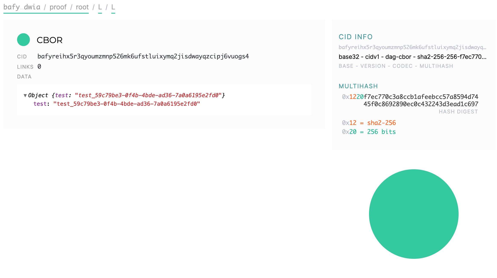
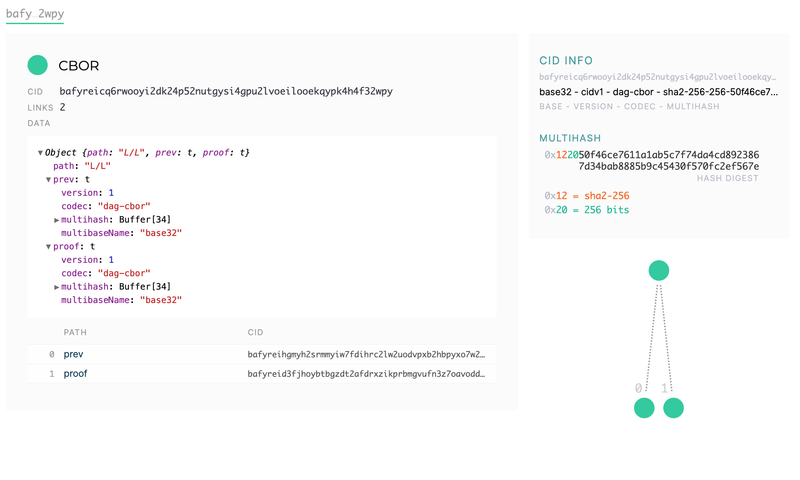
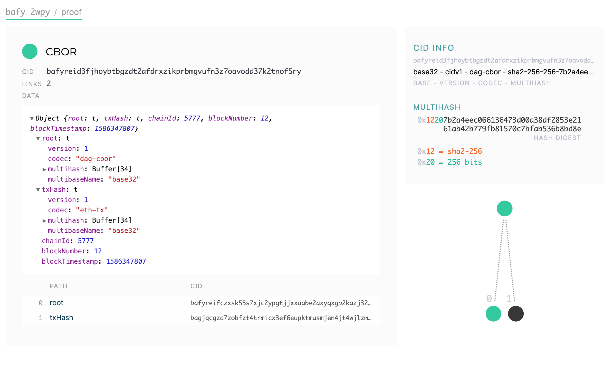

# Ceramic anchor service - PoC
[](https://app.fossa.com/projects/git%2Bgithub.com%2Fceramicnetwork%2Fceramic-anchor-service?ref=badge_shield)


Ceramic anchor service is a PoC of anchor service according to the Ceramic [specification](https://github.com/ceramicnetwork/specs).

This implementation uses Ethereum blockchain but is built in order to be blockchain agnostic. It is fairly easy to add more modules to support other blockchains as well.  

### Prerequisites

In order to run the simulation you need to install [Node.js](https://nodejs.org).

### Installing

Configuration file is located under `./config` directory.

In order to build the application start the IPFS node locally and run the following commands:

```docker-compose up -d```

```npm run build```

```npm run start```

### RESTful APIs

RESTful APIs are enabled on `http://localhost:3000/api/v0/` by default.

----
  #### Create Anchor Request
  
  Creates CID anchor request.

* **URL**

  `/requests`

* **Method:**

  `POST`
  
* **Data Params**<br />

  * **Content:** 
    ```json
      {
      	"cid": "bafyreihgmyh2srmmyiw7fdihrc2lw2uodvpxb2hbpyxo7w2jlqizga6pne",
      	"docId": "doc_875c56f9-9d5d-4031-8d3d-d171a91b15aa" 
      }
    ```

* **Success Response:**

  * **Code:** 201 <br />
    **Content:** 
     ```json
     {
         "id": "06a483c9-eb73-4e08-a019-7b5665588172",
         "status": "PENDING",
         "message": "Request is pending.",
         "cid": "bafyreihgmyh2srmmyiw7fdihrc2lw2uodvpxb2hbpyxo7w2jlqizga6pne",
         "docId": "doc_875c56f9-9d5d-4031-8d3d-d171a91b15aa",
         "createdAt": 1586438625,
         "updatedAt": 1586438625,
         "scheduledAt": 1586438625
     }
     ```

----
  #### Get CID anchor request information
    
  Creates CID anchor request.

* **URL**

  `/requests/:cid`

* **Method:**

  `GET`
  
*  **URL Params**

   **Required:**
 
   `cid=[string]`

* **Data Params**

  None

* **Success Response - `PENDING`:**

  * **Code:** 200 <br />
    **Content:** 
    ```json
    {
        "id": "06a483c9-eb73-4e08-a019-7b5665588172",
        "status": "PENDING",
        "message": "Request is pending.",
        "cid": "bafyreihgmyh2srmmyiw7fdihrc2lw2uodvpxb2hbpyxo7w2jlqizga6pne",
        "docId": "doc_875c56f9-9d5d-4031-8d3d-d171a91b15aa",
        "createdAt": 1586438625,
        "updatedAt": 1586438625,
        "scheduledAt": 1586438625
    }
    ```
* **Success Response - `PROCESSING`:**

  * **Code:** 200 <br />
    **Content:** 
    ```json
    {
        "id": "06a483c9-eb73-4e08-a019-7b5665588172",
        "status": "PROCESSING",
        "message": "Request is processing.",
        "cid": "bafyreihgmyh2srmmyiw7fdihrc2lw2uodvpxb2hbpyxo7w2jlqizga6pne",
        "docId": "doc_875c56f9-9d5d-4031-8d3d-d171a91b15aa",
        "createdAt": "2020-04-08T12:10:06.000Z",
        "updatedAt": "2020-04-08T12:10:07.000Z"
    }
    ```

* **Success Response - `FAILED`:**

  * **Code:** 200 <br />
    **Content:** 
    ```json
    {
        "id": "06a483c9-eb73-4e08-a019-7b5665588172",
        "status": "FAILED",
        "message": "Request failed. Staled request.",
        "cid": "bafyreihgmyh2srmmyiw7fdihrc2lw2uodvpxb2hbpyxo7w2jlqizga6pne",
        "docId": "doc_875c56f9-9d5d-4031-8d3d-d171a91b15aa",
        "createdAt": 1586438625,
        "updatedAt": 1586438625
    }
    ```

* **Success Response - `COMPLETED`:**

  * **Code:** 200 <br />
    **Content:** 
    ```json
    {
        "id": "06a483c9-eb73-4e08-a019-7b5665588172",
        "status": "COMPLETED",
        "message": "CID successfully anchored.",
        "cid": "bafyreihgmyh2srmmyiw7fdihrc2lw2uodvpxb2hbpyxo7w2jlqizga6pne",
        "docId": "doc_875c56f9-9d5d-4031-8d3d-d171a91b15aa",
        "createdAt": 1586438625,
        "updatedAt": 1586438625,
        "anchorRecord": {
            "cid": "bafyreicq6rwooyi2dk24p52nutgysi4gpu2lvoeilooekqypk4h4f32wpy",
            "content": {
                "path": "L/L",
                "prev": "bafyreihgmyh2srmmyiw7fdihrc2lw2uodvpxb2hbpyxo7w2jlqizga6pne",
                "proof": "bafyreid3fjhoybtbgzdt2afdrxzikprbmgvufn3z7oavodd37k2tnof5ry"
            }
        }
    }
    ```
 
* **Error Response:**

  * **Code:** 404 NOT FOUND <br />
    **Content:** `{ error : "Request doesn't exist" }`

## IPFS explorer visualization

The image below represents requested CID IPLD document.

<p align="center">
    
</p>
    
The image below represents anchor record IPLD document.

<p align="center">
    
</p>

The image below represents anchor proof IPLD document.

<p align="center">
    
</p>

## Running the tests

Tests are located in the `test` directory. In order to run test start the following command:

```npm run test```

In order to run tests with coverage run:

```npm run coverage```

## Maintainers
[@simonovic86](https://github.com/simonovic86)

## Built With

* [Node.js - v13.7.0](https://nodejs.org)
* [TypeScript - v3.8.3](https://www.typescriptlang.org)
* [SQLite](https://www.sqlite.org/index.html)

## License

This project is licensed under the MIT License - see the [LICENSE](LICENSE) file for details.


[](https://app.fossa.com/projects/git%2Bgithub.com%2Fceramicnetwork%2Fceramic-anchor-service?ref=badge_large)

## Team

Built with    from [3Box](https://3box.io) team.