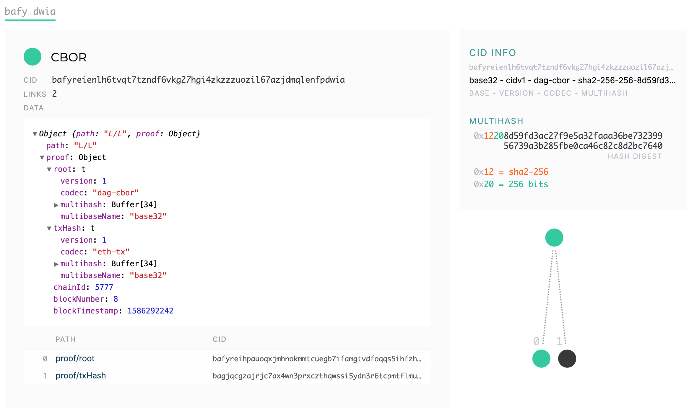

# Ceramic anchor service - PoC

Ceramic anchor service is a PoC of anchor service according to the Ceramic [specification](https://github.com/ceramicnetwork/specs).

This implementation uses Ethereum blockchain but is built in order to be blockchain agnostic. It is fairly easy to add more modules to support other blockchains as well.  

### Prerequisites

In order to run the simulation you need to install [Node.js] (https://nodejs.org).

### Installing

Configuration file is located under `./config` directory.

In order to build the application start the IPFS node locally and run the following commands:

```docker-compose up -d```

```npm run build```

```npm run start```

### RESTful APIs

RESTful APIs are enabled on `http://localhost:3000/api/v0/` by default.

----
  #### Create Anchor Request
  
  Creates CID anchor request.

* **URL**

  `/requests`

* **Method:**

  `GET`
  
*  **URL Params**

   **Required:**
 
   `id=[string]`

* **Data Params**<br />

  * **Content:** 
    ```json
      {
      	"cid": "bafyreicscnpmnk2iu5yukebijgud6yhmq3726dy5leaeknhgblpqrxmmrm",
      	"docId": "documentId" 
      }
    ```

* **Success Response:**

  * **Code:** 200 <br />
    **Content:** 
     ```json
     {
         "cid": "bafyreicscnpmnk2iu5yukebijgud6yhmq3726dy5leaeknhgblpqrxmmrm",
         "docId": "documentId",
         "status": 0,
         "id": "c4823980-dc66-453d-a6c2-28a1c8a48fc0",
         "createdAt": "2020-04-06T10:01:59.000Z",
         "updatedAt": "2020-04-06T10:01:59.000Z"
     }
     ```

----
  #### Get CID anchor request information
    
  Creates CID anchor request.

* **URL**

  `/requests/:id`

* **Method:**

  `GET`
  
*  **URL Params**

   **Required:**
 
   `id=[string]`

* **Data Params**

  None

* **Success Response:**

  * **Code:** 200 <br />
    **Content:** 
    ```json
    {
      "id": "0d6cdc13-e4cd-439e-888d-1ab77f0befa7",
      "status": 2,
      "cid": "bafyreicscnpmnk2iu5yukebijgud6yhmq3726dy5leaeknhgblpqrxmmrm",
      "docId": "doc_4b296dbf-d213-467f-a43d-481cd2cdb342",
      "createdAt": "2020-04-07T20:44:01.000Z",
      "updatedAt": "2020-04-07T20:44:02.000Z",
      "anchorMetadata": {
        "cid": "bafyreihbq4yjuta27wgvnluubxtrt3fms34g3oqqxndtwpj4skhvcqsham",
        "proof": {
          "blockNumber": 8,
          "blockTimestamp": 1586292242,
          "root": "bafyreihpauoqxjmhnokmmtcuegb7ifamgtvdfoqqs5ihfzh5ek7e7ivyhy",
          "chainId": 5777,
          "txHash": "bagjqcgzajrjc7ax4wn3prxczthqwssi5ydn3r6tcpmtflmuacej6h2h7iqba"
        },
        "path": "R/R"
      }
    }
    ```
 
* **Error Response:**

  * **Code:** 404 NOT FOUND <br />
    **Content:** `{ error : "Request doesn't exist" }`

## IPFS explorer visualization

The image below represents requested CID IPLD document.

<p align="center">
    
</p>
    
The image below represents anchor IPLD document.

<p align="center">
    
</p>

## Running the tests

Tests are located in the `test` directory. In order to run test start the following command:

```npm run test```

In order to run tests with coverage run:

```npm run coverate```

## Built With

* [Node.js - v13.7.0](https://nodejs.org)
* [TypeScript - v3.8.3](https://www.typescriptlang.org)
* [SQLite](https://www.sqlite.org/index.html)

## License

This project is licensed under the MIT License - see the [LICENSE](LICENSE) file for details.

## Team

Built with    from [3Box](https://3box.io) team. 